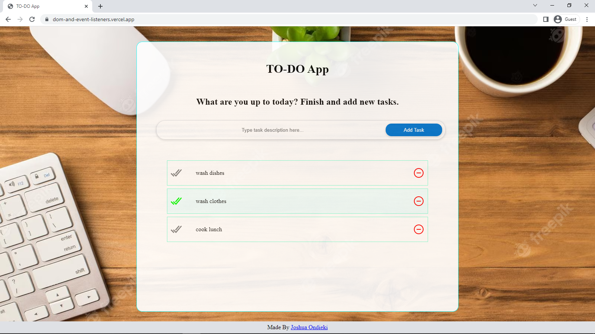
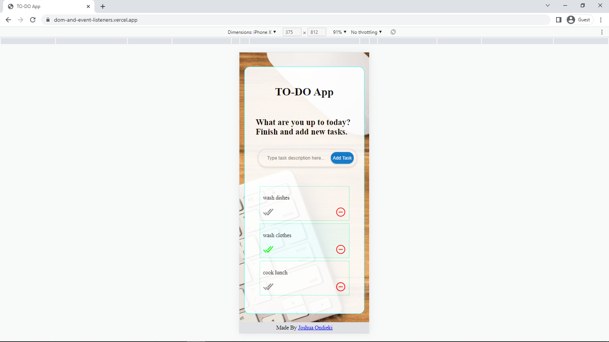

 

# TODO App
A simple crud todo list app to practise and demonstrate my understanding of DOM and event listeners.

This webapp notably makes use of the **built in crypto module** to generate Unique IDs, and **localStorage** to save user data. tasks you add are persisted on the browser forever even after you refresh or close your browser.

## THE Jitu
Tasks completed at THE Jitu Software Developer Training

## DESKTOP DESIGN

## MOBILE DESIGN

